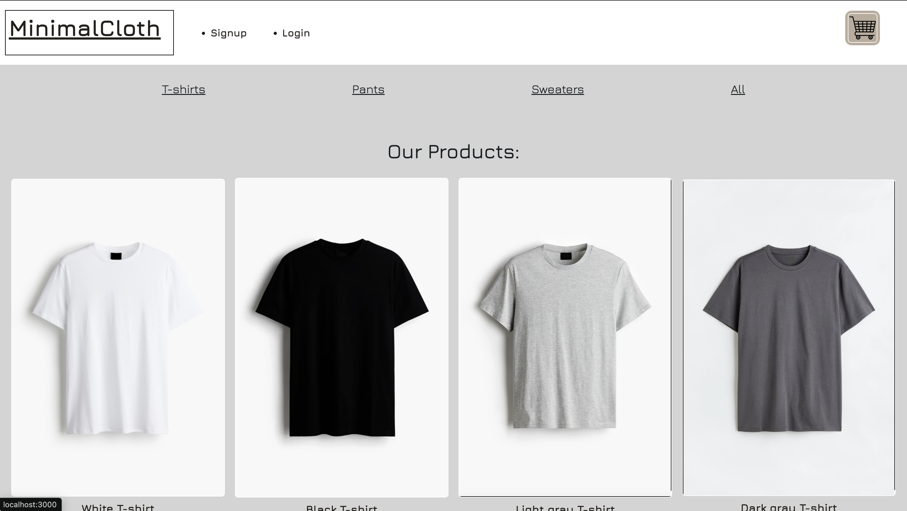

# MinimalCloth

## Description

MinimalCloth is an e-commerce website that offers a wide range of basic clothing items. Our platform provides a seamless shopping experience with easy navigation and secure transactions. Our store takes the hassle out of shopping by offering 5 items in three categories: t-shirts, pants and sweaters for both men and women. Check out the items in each section and choose the basics that you like the most!

## Table of Contents

* [Installation](#installation)
* [Usage](#usage)
* [Credits](#credits)
* [License](#license)

## Installation

[Click here to view the deployed website!](https://e-commerce-project-udvs.onrender.com/) 👕

## Usage

To buy through the MinimalCloth website, first click the link: (deployed website link). Once you are in the website, create your account or log into your account using the Sign up or Log in buttons. Once in, browse all of the sections and click on the item or items of your choice.

Once you choose an item or items, click the checkout button, then click on the cart on the top right corner to see all of the items you picked out. Once you are ready to check out, click on the checkout button and proceed to enter the information you are prompted for.

Our app can be used on desktop or mobile!

## Credits

MinimalCloth©️  was conceptualized and programmed by:
* [Maria Corona](https://github.com/m13corona).
* [Logan McDaniel](https://github.com/lsmcd).
* [Marcos Munoz](https://github.com/marcusmr15).
* [Jaime Tames](https://github.com/jaimetam).
* [Martin Vivanco](https://github.com/MartinVF12).

This project was made possible with the help of:
* Our coding instructor, [Marco Monter](https://github.com/montermarco).
* The [H&M website](https://www2.hm.com/es_mx/index.html) for client-displayed data.
* The `ChatGPT` AI developed by __Open AI__.
* The `Xpert Learning Assistant` AI developed by __EdX__.

## License

This repository does not have a specific license.

// pruebaaaaa